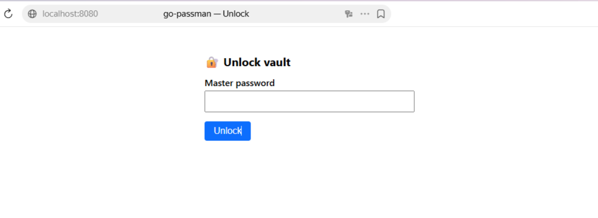
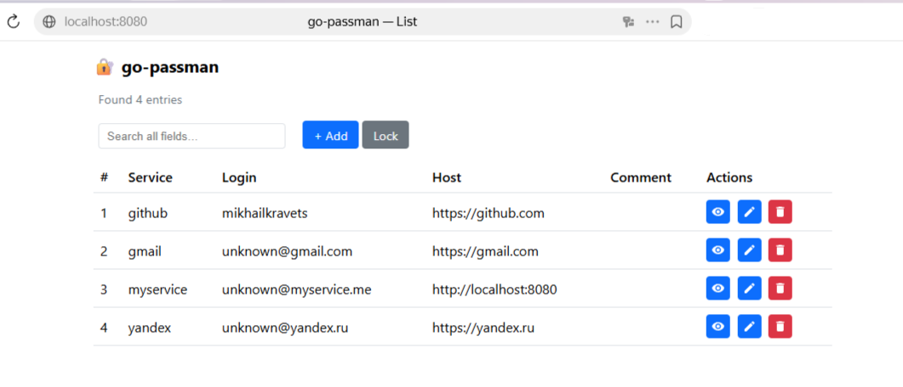
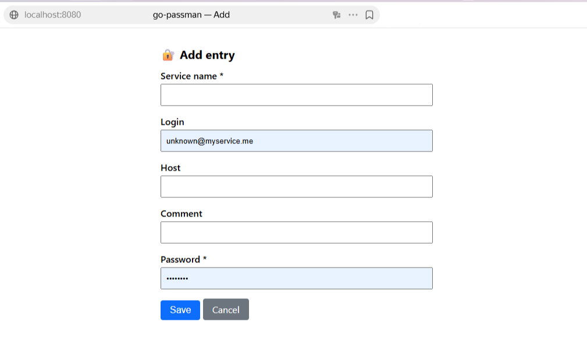

# 🔐 go-passman

A simple and secure **CLI password manager** written in Go.  
Store, manage, encrypt, and decrypt passwords from your terminal.

## 🚀 Features

- Add, remove, update, and list password entries (with optional **login**, **host**, **comment**)
- Copy passwords to clipboard
- Encrypt and decrypt your vault with a master password
- List in **compact** format (fits narrow terminals) or **table** format (`list -t`); entries are **numbered** — use `copy N` or `remove N` for short names. With many entries (e.g. 100+), **list** is paginated (20 per page; Enter = next, q = quit). **Update** and **Remove** support a **filter by name** and paginated choice (25 per page; n = next, q = quit)
- **Copy by number**: `go-passman copy 2` (same order as `list`). **Remove**: run `go-passman remove`, then select from list (like update)
- **Update**: prompt shows current value; **Enter** = keep, type new = replace; after update, **new values** are printed. After each action the list is shown and **Continue?** lets you do multiple updates in one run (30s timeout).
- **Remove**: select from list; after each removal the list is shown and **Continue?** for more (30s timeout).
- **Add** (encrypted vault): vault password is asked first, then service name and other fields.
- **Web interface** (`go-passman -w`): manage passwords in the browser — list with search (all fields), pagination for large vaults, add/edit/delete and show password; encrypted vault unlocks once per session.
- Hidden password input (Windows, Linux, macOS); terminal echo restored on Ctrl+C
- Open the vault in any text editor
- Cross-platform (Linux, macOS, Windows)
- Vault file stored in the same directory as the executable

## 🛠️ Installation

Make sure you have [Go 1.19 or higher installed](https://golang.org/doc/install).

```bash
git clone https://github.com/KravetsMikhail/go-passman.git
cd go-passman
go build -o go-passman
```

You'll find the compiled binary as `go-passman` (or `go-passman.exe` on Windows).

For a **smaller binary** (~7–8 MB instead of ~11 MB), strip debug info:  
`go build -ldflags="-s -w" -trimpath -o go-passman`  
The build scripts (`build.bat` / `build.sh`) use these flags by default. Optional: [UPX](https://upx.github.io/) can compress the binary further (some antivirus may flag it).

Optionally, you can move it to a location in your PATH or create a symlink.

## ▶️ Running the program

**Windows** (Command Prompt or PowerShell, from the project directory):

```batch
.\go-passman.exe --help
.\go-passman.exe add
.\go-passman.exe list
```

If the executable is in your PATH, you can run:

```batch
go-passman --help
go-passman add
```

**Linux / macOS**:

```bash
./go-passman --help
./go-passman add
./go-passman list
```

If installed system-wide (e.g. in `/usr/local/bin`), use `go-passman` without `./`.

## 📝 Usage

Run `go-passman --help` (or `.\go-passman.exe --help` on Windows) to see all available commands and options:

```bash
go-passman --help
```

## 🚀 Command Examples

```bash
# Add a new entry manually
go-passman add

# Add a new entry with generated password
go-passman add --generate

# Copy password to clipboard (by name or by number from list)
go-passman copy github
go-passman copy 2

# Encrypt your vault
go-passman encrypt

# Decrypt your vault
go-passman decrypt

# Open vault with default cat
go-passman open

# Open with nano
go-passman open nano

# List all entries (compact format; fits narrow terminals)
go-passman list

# List as table (use when terminal is wide enough)
go-passman list -t
# or: go-passman list --table

# Filter list by name (substring, case-insensitive); numbers match copy N
go-passman list -f git
# or: go-passman list --filter git

# Update an entry (prompts: current value shown; Enter = keep, type = replace; then new values printed)
go-passman update

# Remove an entry (select from list, like update)
go-passman remove

# Show vault status
go-passman status

# Show vault path
go-passman path

# Run as web server (simple UI)
go-passman -w
# or: go-passman --web
# Opens http://127.0.0.1:8080 (use WEB_PORT env to change port)
```

### Web interface (screenshots)

The web UI lets you list, add, edit, delete entries and view passwords. If the vault is encrypted, you unlock it once in the browser.

| Unlock (encrypted vault) |
|--------------------------|
|  |

| List of entries |
|-----------------|
|  |

| Add entry |
|--------------------------|
|  |


## 🔐 Vault Format

Passwords are stored in a JSON file (typically `vault.json` in the same directory as the executable) with optional encryption using a user-provided password.

When encrypted, the file contents are AES-256-GCM encrypted and base64-encoded.

### Unencrypted Vault Example

```json
{
  "entries": {
    "github": {
      "login": "login1",
      "host": "localhost",
      "comment": "comment",
      "password": "hunter2",
      "encrypted": false
    }
  },
  "encrypted": false
}
```

### Encrypted Vault

When encryption is enabled, the entire file is encrypted and stored as base64-encoded binary data.

## 🧪 Development

Run with:

```bash
go run main.go <COMMAND>
```

Example:

```bash
go run main.go add --generate
```

Run tests:

```bash
go test ./...
```

## 🏗️ Architecture

`go-passman` is built as a modular and extensible Go-based CLI application following a clean separation of concerns. Here's an overview of the core components:

### 🔧 Core Modules

- **`main.go`**  
  Entry point of the application. It creates and executes the root command using Cobra.

- **`cmd/`**  
  Contains the CLI command implementations using Cobra:
  - `root.go` – Root command and command registration
  - `add.go` – Adding new entries
  - `remove.go` – Removing services
  - `copy.go` – Copying passwords to clipboard
  - `open.go` – Opening the vault with a specified editor
  - `update.go` – Updating existing entries
  - `encrypt.go` / `decrypt.go` – Encryption and decryption logic
  - `list.go` – Listing all entries
  - `status.go` – Display vault status
  - `path.go` – Display vault path

- **`internal/crypto/`**  
  Handles encryption and decryption using AES-256-GCM with password-based key derivation (PBKDF2).

- **`internal/storage/`**  
  Handles loading, saving, and serializing the vault file. Supports conditional encryption logic.

- **`internal/models/`**  
  Defines the `Vault` and `PasswordEntry` data structures. Responsible for JSON (de)serialization.

- **`internal/utils/`**  
  Contains utility functions:
  - `password.go` – Password generation
  - `clipboard.go` – Clipboard operations
  - `interactive.go` – Interactive user input

## ⚠️ Requirements

- Go 1.19 or higher
- Cross-platform support (Linux, macOS, Windows)

## 📁 Vault Storage

The vault file (`vault.json`) is stored in the **same directory as the executable**, making it easy to locate and backup.

## 🔐 Security Considerations

- Vault is optionally encrypted using AES-256-GCM with a password-derived key
- Passwords are not stored in plaintext when encryption is enabled
- Password input is hidden in the terminal (cross-platform via `golang.org/x/term`); if you press Ctrl+C during password entry, terminal echo is restored automatically
- For maximum safety, ensure your vault is always encrypted and use a strong master password
- Encrypted vaults are stored as Base64-encoded binary files
- Password-based key derivation using PBKDF2-SHA256 with 100,000 iterations ensures security

## 🧱 Roadmap

- [ ] Implement automatic password expiration warnings
- [ ] Add search/filter command
- [ ] Sync vault to cloud (optional backend)
- [ ] UI with TUI (Bubble Tea) or Web front-end

## 🙋‍♂️ Contributing

Pull requests are welcome. For major changes, please open an issue first to discuss what you would like to change.

1. Fork the project
2. Create your feature branch (`git checkout -b feature/new-feature`)
3. Commit your changes (`git commit -am 'Add new feature'`)
4. Push to the branch (`git push origin feature/new-feature`)
5. Create a new Pull Request

## 📄 License

This project is licensed under the MIT License. See the [LICENSE](LICENSE) file for details.

## ℹ️ Acknowledgments

The idea of ​​the project was borrowed from [Serhii Revva](https://github.com/besha2vox) project [passcli](https://github.com/besha2vox/passcli). Thanks!
